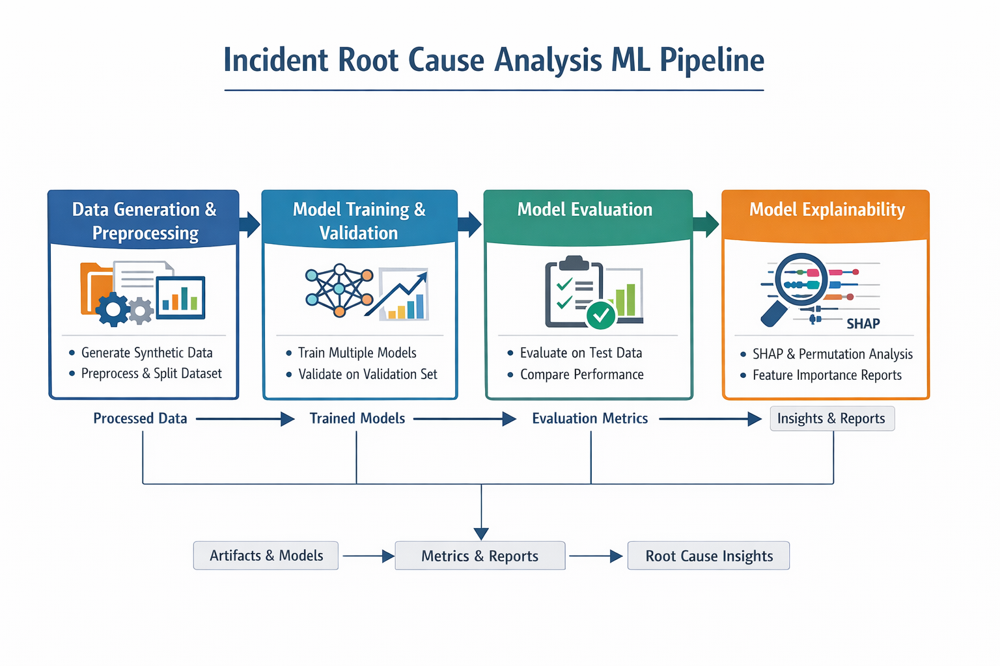
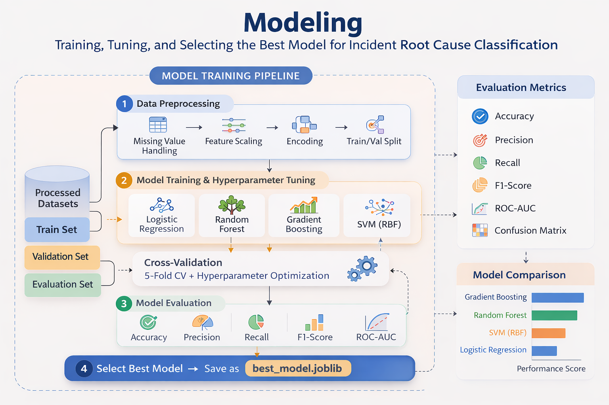
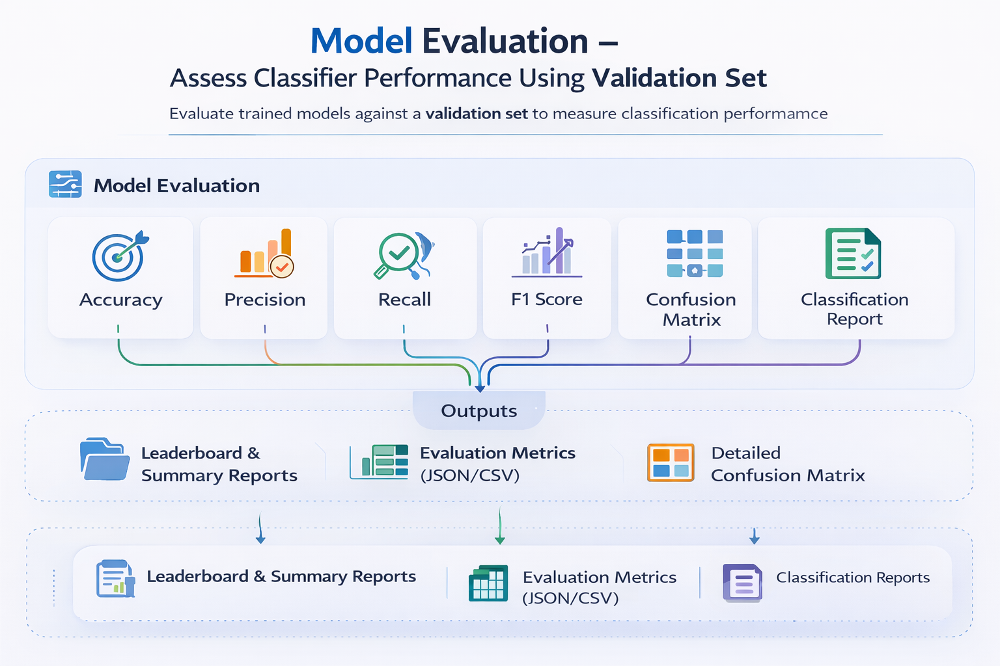

# Incident Intelligence

Incident Intelligence is an end-to-end machine learning pipeline for **incident root cause classification** using operational telemetry signals such as CPU usage, memory growth, request rate, and service latency.

The project demonstrates a full ML workflow including:

- Synthetic incident data generation
- Exploratory data analysis (EDA)
- Model training and evaluation
- Model explainability

The goal is to automatically identify the **underlying cause of production incidents** using system metrics.

---

## Key Features

- Synthetic incident simulation engine for generating labeled telemetry data
- Modular ML pipeline with CLI-based execution
- Multiple classification models with automated comparison
- Automated evaluation outputs including metrics, confusion matrices, comparison plots, and classification reports
- Model explainability using global feature importance and **local incident analysis**
- Fully reproducible dataset generation and training pipeline

---

## Table of Contents

- [Architecture Overview](#architecture-overview)
- [ML Pipeline](#ml-pipeline)
- [Synthetic Dataset](#synthetic-dataset)
- [Modeling Pipeline](#modeling-pipeline)
- [Model Evaluation](#model-evaluation)
- [Model Explainability](#model-explainability)
  - [Local Incident Root Cause Analysis](#local-incident-root-cause-analysis)
- [Quickstart](#quickstart)
- [Running the Pipeline](#running-the-pipeline)
- [Project Structure](#project-structure)
- [Models Evaluated](#models-evaluated)
- [Model Performance](#model-performance)
- [Generated Outputs](#generated-outputs)
- [Feature Dictionary](#feature-dictionary)
- [Notebooks](#notebooks)
- [Reproducibility](#reproducibility)
- [Development Notes](#development-notes)
- [Future Improvements](#future-improvements)

---

## Architecture Overview

The project follows a modular ML pipeline architecture:

- **Config layer** – experiment and dataset configuration ([config/](config/))
- **Core ML logic** – reusable modules ([src/incident_intelligence/](src/incident_intelligence/))
- **Pipeline scripts** – CLI entrypoints for dataset generation, training, evaluation, and explainability ([scripts/](scripts/))
- **Artifacts** – generated models, metrics, plots, reports, and explainability outputs ([artifacts/](artifacts/))

This separation allows the pipeline to be executed via CLI, automated workflows, or orchestration systems.

---

## ML Pipeline

The repository implements a full machine learning lifecycle for incident root cause classification, from synthetic data generation to model training, evaluation, and explainability.



_Figure: High-level machine learning pipeline for incident root cause classification._

The ML pipeline consists of the following stages:

1. Synthetic dataset generation
2. Dataset splitting (train / validation / evaluation)
3. Model training with hyperparameter tuning
4. Model evaluation with saved plots and reports
5. Model explainability

---

## Synthetic Dataset

This project uses a **synthetically generated** incident dataset for development, testing, and evaluation.

The dataset is generated using a configurable simulation framework that models common production failure scenarios observed in real systems.

### Synthetic Incident Generation Pipeline


_Figure: Synthetic incident generation pipeline used to simulate operational telemetry signals and root-cause labels._

The synthetic dataset is generated using a simulation engine that models realistic production telemetry patterns.

The generator simulates signals such as:

- CPU usage
- memory growth
- request throughput
- service latency
- dependency failures
- error rates

Each synthetic incident is assigned a **root cause label**, and system metrics are generated according to statistical distributions defined in `config/class_config.json`.

The generation process:

1. Load root-cause configuration rules
2. Sample a root-cause category
3. Generate baseline system metrics
4. Apply class-specific metric perturbations
5. Simulate metric dependencies (CPU, memory, latency)
6. Generate log signals (OOM events, timeout logs)
7. Produce the final dataset and perform stratified splitting

Dataset generation is controlled by:

- Simulation logic in [`src/incident_intelligence/data/`](src/incident_intelligence/data/)
- Generation parameters defined in [`config/class_config.json`](config/class_config.json)

### Output Dataset

The generated dataset is saved to:

- **File**: [`data/raw/incidents_raw.csv`](data/raw/incidents_raw.csv)
- **Format**: CSV (UTF-8 encoded)
- **Granularity**: One row per synthetic incident snapshot
- **Privacy**: Contains **no production data or PII**

> ⚠️ **Important**: All data is synthetically generated to simulate realistic incident patterns. This is not real production data.

### Data Split

The raw dataset in `data/raw/incidents_raw.csv` is split into:

- Training set
- Validation set
- Evaluation set

The generated dataset is then used to train and evaluate machine learning models for incident root cause classification.

Full column descriptions are provided in the [Feature Dictionary](#feature-dictionary) section below.

---

## Modeling Pipeline

After generating the synthetic dataset, the modeling stage trains multiple machine learning models to classify the root cause of incidents using system telemetry features.



_Figure: Model training pipeline including preprocessing, cross-validation, model comparison, and best model selection._

The modeling workflow includes:

1. Preprocessing and scaling when required by the model
2. Training multiple classification algorithms
3. Hyperparameter tuning using cross-validation
4. Preliminary model validation
5. Selecting and saving the best performing model

The final selected model is saved as:

```text
artifacts/models/best_model.joblib
```

The trained candidate models are then passed to the evaluation stage for comparison across validation and evaluation datasets.

---

## Model Evaluation

After training candidate models, their performance is evaluated on the validation and evaluation datasets.



_Figure: Model evaluation process measuring classifier performance across multiple metrics._

The evaluation stage measures model performance using several standard classification metrics:

- Accuracy
- Precision (macro)
- Recall (macro)
- F1 Score (macro)
- ROC-AUC (if applicable)

### Evaluation Outputs

The evaluation pipeline now saves both machine-readable metrics and human-readable artifacts automatically.

Generated evaluation artifacts include:

- validation leaderboard (`artifacts/metrics/leaderboard_val.csv`)
- evaluation summary metrics (`artifacts/metrics/evaluation_summary.csv`)
- detailed evaluation metrics (`artifacts/metrics/evaluation.json`)
- per-model confusion matrix plots (`artifacts/plots/`)
- per-model feature-importance plots when supported (`artifacts/plots/`)
- model comparison chart (`artifacts/plots/model_comparison.png`)
- per-model classification reports (`artifacts/reports/`)

### Example Confusion Matrix

Below is an example confusion matrix for the best-performing model on the evaluation dataset.


_Figure: Confusion matrix illustrating classification performance across incident root-cause categories._

Evaluation results are used to compare candidate models and select the best performing one.

### Saved Plot and Report Structure

```text
artifacts/
├── metrics/
│   ├── evaluation.json
│   ├── evaluation_summary.csv
│   ├── leaderboard_val.csv
│   └── train_val_results.json
├── plots/
│   ├── confusion_matrix_<model>.png
│   ├── feature_importance_<model>.png
│   └── model_comparison.png
└── reports/
    └── <model>_classification_report.md
```

> ⚠️ **Note**
> Feature-importance plots are only generated for models that expose importances or coefficients. For example, tree-based models and logistic regression are supported, while SVM (RBF) is skipped.

Once the best-performing model is selected, explainability artifacts are generated to interpret model predictions.

---

## Model Explainability

After selecting the best performing model, the pipeline generates explainability artifacts to help interpret model predictions.

Model explainability provides insight into **which system telemetry features most strongly influence incident root cause predictions**.

This is important for:

- Understanding how the model makes decisions
- Identifying which signals are most relevant during incidents
- Increasing trust in automated incident classification systems
- Supporting debugging and operational analysis

The explainability step generates:

- Global feature importance visualizations
- Ranked feature importance tables
- Explainability summary reports

Example output:


_Example: Global feature importance showing the relative impact of telemetry features on model predictions._

Detailed explainability artifacts and exported files are described in the **Generated Outputs** section below.

### Local Incident Root Cause Analysis

In addition to global feature importance, the project supports **local explainability** to analyze individual incident predictions.

Local explainability helps answer the question:

> _Why did the model classify this specific incident as a particular root cause?_

For selected incidents in the evaluation dataset, the pipeline generates:

- SHAP waterfall plots for the predicted class
- Top candidate root causes with prediction probabilities
- Feature contributions driving each prediction
- Human-readable HTML root cause analysis reports

These reports simulate a real incident investigation workflow by showing which telemetry signals influenced the model's decision.

#### Running Local Explainability

Explain predictions for the best trained model:

```bash
incident-explain-local --model artifacts/models/best_model.joblib
```

Explain specific incidents:

```bash
incident-explain-local \
  --model artifacts/models/best_model.joblib \
  --row-indices 12 47 108
```

Explain a random subset of incidents:

```bash
incident-explain-local \
  --model artifacts/models/best_model.joblib \
  --n-examples 5
```

#### Generated Reports

Local explainability artifacts are written to:

```text
artifacts/
└── explain/
    └── <model_name>/
        └── local/
```

Example Output:

```text
row_12_waterfall.png
row_12_report.html

row_47_waterfall.png
row_47_report.html

row_108_waterfall.png
row_108_report.html

local_explainability_index.html
local_explainability_summary.json
```

Open the following file in a browser:

```text
artifacts/explain/<model_name>/local/local_explainability_index.html
```

This page links to all generated incident investigation reports.

---

## Quickstart

### 1. Clone the repository

```bash
git clone https://github.com/<your-org>/incident-intelligence.git
cd incident-intelligence
```

### 2. Create and activate a virtual environment (macOS / Linux)

```bash
python3 -m venv .venv
source .venv/bin/activate
```

### 3. Install dependencies

```bash
pip install -r requirements.txt
pip install -e .
```

### 4. Run the pipeline

```bash
incident-pipeline
```

This command will:

- Generate the synthetic dataset
- Train the models
- Evaluate model performance
- Save metrics, plots, and reports
- Produce explainability artifacts

After completion you should see generated outputs in:

```text
artifacts/
├── models/
├── metrics/
├── plots/
├── reports/
└── explain/
```

---

## Running the Pipeline

The pipeline can be executed via **CLI commands (recommended)**, a **Makefile**, or **direct scripts**.

### Option 1 - CLI Commands (Recommended)

#### 1. Install the project in editable mode

Run from the project root:

```bash
pip install -e .
```

#### 2. Run the full pipeline

```bash
incident-pipeline
```

#### 3. Run individual stages

```bash
incident-generate
incident-train
incident-eval
incident-explain
incident-explain-local --model artifacts/models/best_model.joblib
```

> Note: If the CLI commands are not available, ensure you ran `pip install -e .` successfully.
> The CLI entry points expect modules under `incident_intelligence.cli.*`. If you prefer not to use the CLI, use one of the alternatives below.

### Option 2 - Makefile

#### 1. Run the full pipeline

```bash
make pipeline  # run full pipeline
```

#### 2. Run individual steps

```bash
make generate
make train
make evaluate
make explain
```

### Option 3 - Run Scripts Directly

#### 1. Run the full pipeline

```bash
python scripts/run_pipeline.py
```

#### 2. Run individual steps

```bash
python scripts/generate_dataset.py
python scripts/train.py
python scripts/evaluate.py
python scripts/explain.py
```

---

## Project Structure

```text
incident-intelligence/
├── artifacts/                      # Generated models, metrics, plots, reports, explainability assets
├── config/
│   └── class_config.json           # Class/label configuration
├── data/
│   ├── raw/                        # Raw input data
│   │   └── incidents_raw.csv
│   └── processed/                  # Train/validation/eval splits
│       ├── incident_root_cause_train.csv
│       ├── incident_root_cause_val.csv
│       └── incident_root_cause_eval.csv
├── notebooks/
│   ├── explainability_outputs/     # Explainability plots/tables
│   ├── 01_data_generation.ipynb
│   ├── 02_eda.ipynb
│   ├── 03_baseline_model.ipynb
│   └── 04_model_explainability.ipynb
├── scripts/
│   ├── generate_dataset.py         # Build dataset artifacts
│   ├── train.py                    # Train model(s)
│   ├── evaluate.py                 # Evaluate model(s)
│   ├── explain.py                  # Explainability artifacts (e.g., SHAP)
│   └── run_pipeline.py             # End-to-end pipeline runner
├── src/incident_intelligence/
│   ├── api/                        # API-related code
│   ├── data/                       # Data processing utilities
│   ├── modeling/                   # Modeling/training utilities
│   ├── __init__.py
│   └── settings.py                 # Central project settings
├── pyproject.toml
├── requirements.txt
└── README.md
```

---

## Models Evaluated

The training pipeline evaluates multiple classification algorithms:

- Logistic Regression
- Random Forest
- Gradient Boosting
- Support Vector Machine (RBF)

Each model is trained using a standardized preprocessing pipeline and assessed on validation and evaluation datasets.

The best-performing model is automatically selected and saved as:

`artifacts/models/best_model.joblib`

**Note:** All models are trained on the training dataset and assessed on validation and evaluation datasets to ensure fair comparison.

---

## Model Performance

The training pipeline evaluates several candidate models and compares their performance using validation and evaluation datasets.

Example validation leaderboard (results will vary depending on generated data):

| Model               | Accuracy | Precision | Recall   | F1 Score |
| ------------------- | -------- | --------- | -------- | -------- |
| Logistic Regression | 0.82     | 0.81      | 0.80     | 0.80     |
| Random Forest       | 0.88     | 0.87      | 0.86     | 0.86     |
| Gradient Boosting   | **0.90** | **0.89**  | **0.89** | **0.89** |
| SVM (RBF)           | 0.87     | 0.86      | 0.85     | 0.85     |

The best-performing model is automatically selected and saved as:

`artifacts/models/best_model.joblib`

Full evaluation results are available in:

- `artifacts/metrics/leaderboard_val.csv`
- `artifacts/metrics/evaluation_summary.csv`
- `artifacts/metrics/evaluation.json`

Visual summaries and per-model reports are available in:

- `artifacts/plots/`
- `artifacts/reports/`

---

## Generated Outputs

> ⚠️ **Note**
>
> Files inside the `artifacts/` directory are **generated outputs** produced by the pipeline.
> They are **not checked into version control** and will appear only after running the pipeline locally.

This section describes all artifacts generated during model training and evaluation. These files are created in the [`artifacts/`](artifacts/) directory when you run the training pipeline.

### Directory Structure

```text
artifacts/
├── explain/          # Model explainability artifacts
├── metrics/          # Performance metrics and evaluation results
├── models/           # Trained model files
├── plots/            # Saved evaluation plots
└── reports/          # Saved per-model classification reports
```

### Evaluation Artifacts (`artifacts/metrics/`, `artifacts/plots/`, `artifacts/reports/`)

#### Metrics Files `artifacts/metrics/`

| File                     | Description                                    |
| ------------------------ | ---------------------------------------------- |
| `evaluation.json`        | Detailed evaluation metrics in JSON format     |
| `evaluation_summary.csv` | Summary of evaluation metrics across models    |
| `leaderboard_val.csv`    | Validation leaderboard comparing all models    |
| `train_val_results.json` | Training and validation results for all models |

#### Saved Plots `artifacts/plots/`

| File Pattern                           | Description                                      |
| -------------------------------------- | ------------------------------------------------ |
| `plots/confusion_matrix_<model>.png`   | Per-model confusion matrix                       |
| `plots/feature_importance_<model>.png` | Per-model feature-importance plot when supported |
| `plots/model_comparison.png`           | Comparison chart across evaluated models         |

#### Saved Reports `artifacts/reports/`

| File Pattern                               | Description                                          |
| ------------------------------------------ | ---------------------------------------------------- |
| `reports/<model>_classification_report.md` | Per-model classification report exported in Markdown |

### Explainability Artifacts (`artifacts/explain/`)

Visual explanations and feature importance analysis for different models.

#### Sample Output

Below is an example of a global feature importance visualization generated by the explainability pipeline:


_Example: Global feature importance showing the top features ranked by their contribution to model predictions._

The visualizations show:

- **Feature Names**: Input variables from the dataset (e.g., `avg_cpu_usage`, `mem_growth`)
- **Importance Scores**: Quantitative measure of each feature's impact on predictions
- **Ranked Display**: Features ordered from most to least important

#### Generated Files

| Model               | Global Importance Plot                               | CSV Data                                             |
| ------------------- | ---------------------------------------------------- | ---------------------------------------------------- |
| Best Model          | `best_model_global_importance.png`                   | `best_model_global_importance.csv`                   |
| Gradient Boosting   | `Gradient_Boosting_pipeline_global_importance.png`   | `Gradient_Boosting_pipeline_global_importance.csv`   |
| Logistic Regression | `Logistic_Regression_pipeline_global_importance.png` | `Logistic_Regression_pipeline_global_importance.csv` |
| Random Forest       | `Random_Forest_pipeline_global_importance.png`       | `Random_Forest_pipeline_global_importance.csv`       |
| SVM (RBF)           | `SVM_(RBF)_pipeline_global_importance.png`           | `SVM_(RBF)_pipeline_global_importance.csv`           |

**Additional Files:**

- `explainability_summary.json` - Summary of explainability metrics across all models

### Trained Models (`artifacts/models/`)

All trained models saved in joblib format for easy deployment:

- `best_model.joblib` - Best performing model selected from validation results
- `Gradient_Boosting_pipeline.joblib` - Gradient Boosting classifier pipeline
- `Logistic_Regression_pipeline.joblib` - Logistic Regression classifier pipeline
- `Random_Forest_pipeline.joblib` - Random Forest classifier pipeline
- `SVM_(RBF)_pipeline.joblib` - Support Vector Machine with RBF kernel pipeline

**Note:** Model artifacts are not checked into version control due to file size. Run the training pipeline to generate them locally.

---

## Feature Dictionary

This section describes all input features and the target variable used for model training.

### Input Features

| Feature               | Type    | Description                                                                                                            |
| --------------------- | ------- | ---------------------------------------------------------------------------------------------------------------------- |
| `avg_cpu_usage`       | float   | Average CPU utilization (%) during the incident observation window. Higher values indicate CPU pressure or saturation. |
| `mem_growth`          | float   | Memory growth rate over the observation period. Elevated values may indicate memory leaks or memory pressure.          |
| `oom_log_count`       | integer | Count of out-of-memory (OOM) events logged during the incident window.                                                 |
| `request_rate`        | float   | Incoming request throughput (requests per unit time) observed during the incident.                                     |
| `error_rate`          | float   | Application/service error rate during the incident window.                                                             |
| `latency`             | float   | End-to-end service latency measured during the incident period.                                                        |
| `upstream_error_rate` | float   | Error rate from upstream/downstream dependencies affecting the service.                                                |
| `dependency_latency`  | float   | Latency contributed by dependent services or external systems.                                                         |
| `timeout_log_count`   | integer | Count of timeout-related log events during the incident window.                                                        |

### Target Variable

| Column             | Type        | Description                                                   |
| ------------------ | ----------- | ------------------------------------------------------------- |
| `root_cause_label` | categorical | Synthetic root-cause classification label (prediction target) |

### Possible Root Cause Labels

Based on the synthetic data generation, the following root cause categories are present:

- `memory_leak` - Memory-related issues causing gradual performance degradation
- `bad_deployment` - Issues introduced by recent code or configuration deployments
- `external_dependency_failure` - Failures caused by external service dependencies
- `cpu_saturation` - CPU resource exhaustion
- `traffic_spike` - Sudden increase in traffic causing system overload
- `normal` - No incident / normal operational state

### CSV Header Format

```csv
avg_cpu_usage,mem_growth,oom_log_count,request_rate,error_rate,latency,upstream_error_rate,dependency_latency,timeout_log_count,root_cause_label
```

### Sample Data Row

```csv
87.00089104373197,2.504895389677996,4,549.031934807165,2.0242063636527776,441.29667286645815,1.7617296375792422,419.79306285037956,2,memory_leak
```

---

## Notebooks

The following notebooks provide exploratory analysis and model experimentation.

- **[01_data_generation.ipynb](notebooks/01_data_generation.ipynb)**  
  Creates and validates the working dataset from source inputs.

- **[02_eda.ipynb](notebooks/02_eda.ipynb)**  
  Performs exploratory data analysis (distributions, missing values, trends, correlations).

- **[03_baseline_model.ipynb](notebooks/03_baseline_model.ipynb)**  
  Trains baseline models and compares initial performance.

- **[04_model_explainability.ipynb](notebooks/04_model_explainability.ipynb)**  
  Produces explainability outputs such as feature importance and model interpretation artifacts.

Recommended order: **01 → 02 → 03 → 04**

---

## Reproducibility

- The pipeline uses fixed random seeds where possible to ensure reproducible results.
- Synthetic dataset generation and model training both use deterministic seeds.
- To regenerate the dataset: `incident-generate`
- Running the pipeline multiple times with the same configuration should produce similar model results.

---

## Development Notes

- Keep large datasets and model binaries out of git unless required.
- Update [`config/class_config.json`](config/class_config.json) and [`src/incident_intelligence/settings.py`](src/incident_intelligence/settings.py) before running custom experiments.
- Prefer CLI / scripts / Makefile for reproducibility; use notebooks for analysis and diagnostics.
- Markdown report export may require the optional `tabulate` package for Pandas `to_markdown()` support.

---

## Future Improvements

Potential enhancements include:

- Integration with real production telemetry datasets
- Automated hyperparameter tuning (Optuna / Ray Tune)
- Model monitoring and drift detection
- Real-time inference API deployment
- Integration with workflow orchestration tools (Airflow / Prefect)
