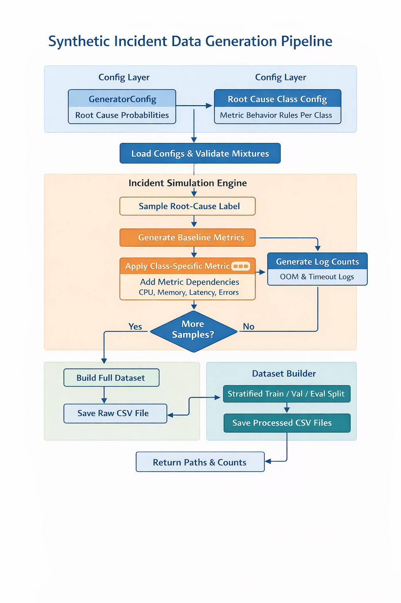
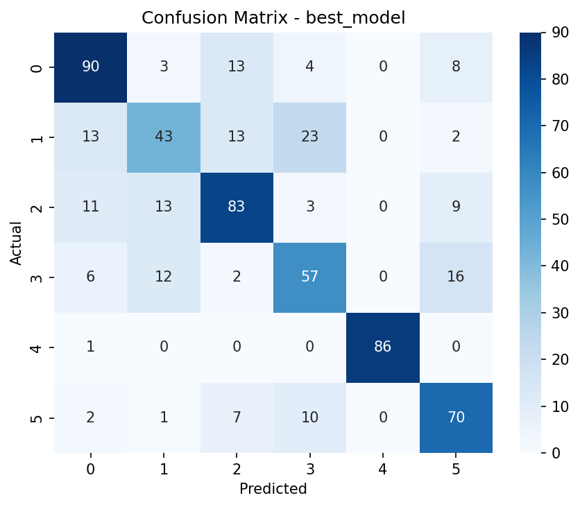

# Incident Intelligence

Incident Intelligence is an end-to-end machine learning project for classifying incident root causes from synthetic telemetry data.

The repository now supports two workflows:

- `snapshot`: one row per incident with aggregate telemetry features
- `temporal`: multi-step incident sequences that are transformed into temporal features before training

The project covers dataset generation, model training, evaluation, global explainability, and local per-incident explainability through a CLI-first workflow, and now also includes a demo dashboard with a FastAPI backend and React frontend.

## Why This Project

I built this project to explore a problem that sits between software engineering, production support, and applied machine learning: how to distinguish likely incident causes from noisy telemetry patterns.

This is the kind of problem that matters because:

- many incidents look similar at first glance
- the same symptom can come from different causes
- static metrics alone often miss how an incident evolved over time
- explainability matters if a prediction is going to help an engineer investigate faster

For portfolio purposes, the goal was not just to train a classifier. The goal was to show end-to-end engineering ownership across:

- data generation and feature design
- model training and evaluation
- explainability
- productization through APIs and a dashboard
- testing, CI, and deployment packaging

## Why Temporal Workflow Exists

The snapshot workflow is a useful baseline, but incident diagnosis is often a time-pattern problem rather than a single-row classification problem.

Examples:

- a memory leak is usually a trend, not just “memory is high”
- a deployment issue often looks like a changepoint
- a traffic spike is defined by burst shape and propagation
- a dependency failure can cascade through latency and upstream-error relationships over time

That is why this repository supports two workflows:

- `snapshot` for a fast, simpler baseline
- `temporal` for sequence-aware feature engineering that captures slopes, deltas, spike behavior, AUC, and cross-metric relationships

## Tradeoffs Explored

A few of the deliberate tradeoffs in this project are:

- synthetic data vs real production data
  - synthetic data makes the project reproducible and safe to share
  - it also means realism has to be designed intentionally
- snapshot vs temporal modeling
  - snapshot is easier to train and explain
  - temporal is more expressive, but slower and easier to overfit if the generator is too clean
- explainability vs speed
  - SHAP and local explanations add value for investigation
  - they also increase runtime and implementation complexity
- CLI-first workflow vs app-first workflow
  - the CLI keeps the pipeline scriptable and testable
  - the dashboard makes it easier to demonstrate and inspect results interactively

## What Is Synthetic Versus Production-Like

This repository uses synthetic incident data throughout. That is intentional.

Synthetic:

- the raw telemetry and incident labels are generated locally
- the incident classes are designed, not collected from real systems
- the evaluation environment is controlled and reproducible

Production-like:

- the workflow structure mirrors a real ML system
- there are separate train/validation/eval datasets
- there are multiple model families, metrics, reports, plots, and explanation outputs
- there is a backend API, frontend dashboard, test coverage, CI, and deployment packaging

So the repo is best understood as a realistic engineering demo of an ML workflow, not as a claim of production-grade incident detection accuracy.

## What I Learned

The biggest practical lessons from this project were:

- dataset realism matters more than headline accuracy
- temporal features can be very strong, but they can also make synthetic tasks unrealistically easy
- artifact naming and dataset-kind separation become important quickly once snapshot and temporal flows coexist
- explainability features are valuable, but they require careful handling around model compatibility, runtime cost, and user experience
- once a project grows beyond a script, packaging, tests, CI, deployment, and presentation matter just as much as the model code

## Visual Walkthrough

Architecture and workflow:



Sample evaluation and explainability outputs:




## What The Project Does

The pipeline simulates production-style incidents using signals such as:

- CPU usage
- memory growth
- request rate
- latency
- upstream/dependency failures
- error and timeout signals

It then trains baseline classifiers to predict a synthetic `root_cause_label` such as:

- `memory_leak`
- `bad_deployment`
- `external_dependency_failure`
- `cpu_saturation`
- `traffic_spike`
- `normal`

## Current Workflows

### Snapshot Workflow

The snapshot workflow generates a flat incident dataset and writes:

```text
data/raw/incidents_raw.csv
data/processed/incident_snapshot_train.csv
data/processed/incident_snapshot_val.csv
data/processed/incident_snapshot_eval.csv
```

This path is driven by:

- [src/incident_intelligence/cli/generator.py](/Users/swethachakravarthy/Projects/incident-intelligence/src/incident_intelligence/cli/generator.py)
- [src/incident_intelligence/data/generate_snapshot.py](/Users/swethachakravarthy/Projects/incident-intelligence/src/incident_intelligence/data/generate_snapshot.py)

Generated datasets under `data/` are local runtime outputs and are intentionally not committed to the repository.

### Temporal Workflow

The temporal workflow generates incident sequences first, then builds aggregate temporal features from each sequence.

It writes:

```text
data/raw/incidents_sequence_raw.csv
data/processed/incident_temporal_all.csv
data/processed/incident_temporal_train.csv
data/processed/incident_temporal_val.csv
data/processed/incident_temporal_eval.csv
```

This path is driven by:

- [src/incident_intelligence/cli/generate_sequence.py](/Users/swethachakravarthy/Projects/incident-intelligence/src/incident_intelligence/cli/generate_sequence.py)
- [src/incident_intelligence/cli/build_temporal_features.py](/Users/swethachakravarthy/Projects/incident-intelligence/src/incident_intelligence/cli/build_temporal_features.py)
- [src/incident_intelligence/data/generate_sequence.py](/Users/swethachakravarthy/Projects/incident-intelligence/src/incident_intelligence/data/generate_sequence.py)
- [src/incident_intelligence/data/temporal_features.py](/Users/swethachakravarthy/Projects/incident-intelligence/src/incident_intelligence/data/temporal_features.py)
- [src/incident_intelligence/data/splitters.py](/Users/swethachakravarthy/Projects/incident-intelligence/src/incident_intelligence/data/splitters.py)

Generated datasets under `data/` are local runtime outputs and are intentionally not committed to the repository.

## CLI Commands

The installed CLI entrypoints are defined in [pyproject.toml](/Users/swethachakravarthy/Projects/incident-intelligence/pyproject.toml).

| Command | Description |
| --- | --- |
| `incident-generate` | Generate snapshot data and train/val/eval splits |
| `incident-generate-sequence` | Generate raw incident sequences |
| `incident-build-temporal-features` | Convert raw sequences into temporal feature datasets |
| `incident-train` | Train baseline models |
| `incident-evaluate` | Evaluate saved models |
| `incident-explain` | Generate global explainability artifacts |
| `incident-explain-local` | Generate local explainability artifacts for selected incidents |
| `incident-pipeline` | Run the full snapshot or temporal workflow |
| `incident-api` | Run the dashboard backend API |

## Dashboard App

The repository now includes a lightweight full-stack demo app:

- Backend API: [src/incident_intelligence/api/app.py](/Users/swethachakravarthy/Projects/incident-intelligence/src/incident_intelligence/api/app.py)
- Frontend dashboard: [web/src/App.jsx](/Users/swethachakravarthy/Projects/incident-intelligence/web/src/App.jsx)

The dashboard is intended to demonstrate the ML pipeline end to end rather than serve production traffic. It focuses on:

- running snapshot and temporal pipeline jobs
- viewing latest metrics and artifacts
- browsing generated plots, reports, and explainability outputs
- inspecting background job logs from the UI
- persisting pipeline run history in SQLite across backend restarts
- deleting completed and failed pipeline runs from the UI
- surfacing evaluation and explainability visuals like confusion matrices, feature-importance charts, and SHAP outputs directly in the UI

Dashboard run metadata is currently persisted at:

```text
artifacts/api_runs/jobs.sqlite3
```

Associated job logs are stored under:

```text
artifacts/api_runs/
```

## CI And Deployment

The repository now includes:

- CI workflow: [.github/workflows/ci.yml](/Users/swethachakravarthy/Projects/incident-intelligence/.github/workflows/ci.yml)
- container publish workflow: [.github/workflows/deploy.yml](/Users/swethachakravarthy/Projects/incident-intelligence/.github/workflows/deploy.yml)
- API container image: [Dockerfile.api](/Users/swethachakravarthy/Projects/incident-intelligence/Dockerfile.api)
- frontend container image: [Dockerfile.web](/Users/swethachakravarthy/Projects/incident-intelligence/Dockerfile.web)
- local/full-stack deployment config: [docker-compose.yml](/Users/swethachakravarthy/Projects/incident-intelligence/docker-compose.yml)
- hosted deployment guide: [docs/deployment.md](/Users/swethachakravarthy/Projects/incident-intelligence/docs/deployment.md)

### CI

The CI workflow runs on pull requests and pushes to `main` and does the following:

- installs Python and Node dependencies
- runs backend and frontend tests with `make test`
- builds the frontend bundle
- builds both Docker images to catch deployment regressions early

### Release Automation

The publish workflow runs on pushes to `main` and on manual dispatch. It builds and pushes two container images to GitHub Container Registry:

- `ghcr.io/<owner>/<repo>/api`
- `ghcr.io/<owner>/<repo>/web`

The repo now also documents a concrete hosted deployment target and release flow in [docs/deployment.md](/Users/swethachakravarthy/Projects/incident-intelligence/docs/deployment.md). The current automation publishes release artifacts; the hosted demo deployment is documented for Render rather than fully automated inside GitHub Actions.

### Local Deployment

You can run the full stack locally with Docker:

```bash
make docker-build
make docker-up
```

Default local deployment URLs:

- frontend: `http://localhost:8080`
- backend API: `http://localhost:8000`

The Docker stack now mounts local runtime directories into the API container so generated data, plots, reports, logs, and job-history persistence survive container restarts:

- `./artifacts -> /app/artifacts`
- `./data -> /app/data`

To stop the stack:

```bash
make docker-down
```

### Deployment Smoke Test Checklist

After starting the stack, a quick local verification pass is:

1. Open the frontend at `http://localhost:8080` or your overridden web port.
2. Confirm the API health endpoint responds at `http://localhost:8000/api/health`.
3. Confirm the dashboard summary loads without an error banner.
4. Switch between `snapshot` and `temporal` in the UI and verify both views load.
5. Start a pipeline job from the dashboard and confirm:
   - a new job appears in the job list
   - the selected job log begins updating
6. Stop the stack with `make docker-down`.

### Backend API Endpoints

Current backend endpoints include:

- `GET /api/health`
- `GET /api/config`
- `GET /api/dashboard/summary/{dataset_kind}`
- `GET /api/artifacts/{dataset_kind}`
- `GET /api/files/{file_path}`
- `POST /api/pipeline/run`
- `GET /api/pipeline/jobs`
- `GET /api/pipeline/jobs/{job_id}`
- `GET /api/pipeline/jobs/{job_id}/log`
- `DELETE /api/pipeline/jobs/{job_id}`

## Quickstart

### 1. Create an environment

```bash
python3 -m venv .venv
source .venv/bin/activate
python -m pip install -e ".[dev]"
```

### 2. Run the backend API

```bash
incident-api
```

Equivalent Make target:

```bash
make api
```

### 3. Run the frontend dashboard

```bash
make web-install
make web-dev
```

The default URLs are:

- API: `http://127.0.0.1:8000`
- Frontend: `http://127.0.0.1:5173`

### 4. Run the snapshot pipeline from CLI

```bash
incident-pipeline
```

### 5. Run the temporal pipeline from CLI

```bash
incident-pipeline --dataset-kind temporal
```

For headless environments, the temporal pipeline is often safest with:

```bash
MPLBACKEND=Agg incident-pipeline --dataset-kind temporal
```

## Recommended Commands

### Snapshot End To End

```bash
incident-pipeline
```

### Temporal End To End

```bash
incident-pipeline --dataset-kind temporal
```

### Temporal End To End With Faster Training

The temporal workflow can be slower because it runs cross-validated grid search across multiple models on a wider feature set. For quicker iteration:

```bash
MPLBACKEND=Agg incident-pipeline \
  --dataset-kind temporal \
  --fast-mode \
  --models logistic,rf \
  --n-jobs 1 \
  --cv 3 \
  --verbose 0
```

### Run Individual Temporal Stages

```bash
incident-generate-sequence
incident-build-temporal-features
incident-train --dataset-kind temporal
incident-evaluate --dataset-kind temporal
incident-explain --dataset-kind temporal
incident-explain-local --dataset-kind temporal
```

### Run The Same Flows With Make

```bash
make generate
make train
make evaluate
make explain
make explain-local

make generate-sequence
make build-temporal-features
make train-temporal
make evaluate-temporal
make explain-temporal
make explain-local-temporal
make pipeline-temporal
make pipeline-temporal-fast
make api
make web-install
make web-dev
make docker-build
make docker-up
make docker-down
```

Snapshot is the default Makefile workflow, so `make pipeline` runs the snapshot pipeline and `make pipeline-temporal` runs the temporal one.

## Training Controls

Training supports configurable search behavior through [src/incident_intelligence/cli/train.py](/Users/swethachakravarthy/Projects/incident-intelligence/src/incident_intelligence/cli/train.py) and [src/incident_intelligence/cli/pipeline.py](/Users/swethachakravarthy/Projects/incident-intelligence/src/incident_intelligence/cli/pipeline.py).

Available options include:

- `--dataset-kind {snapshot,temporal}`
- `--cv`
- `--n-jobs`
- `--verbose`
- `--scoring`
- `--models`
- `--fast-mode`

Example:

```bash
incident-train \
  --dataset-kind temporal \
  --fast-mode \
  --models logistic,rf \
  --n-jobs 1 \
  --cv 3
```

Supported model aliases are:

- `logistic`
- `rf`
- `gb`
- `svm`

## Artifact Layout

Runtime artifacts in `artifacts/` are generated locally by training, evaluation, explainability, and dashboard runs. The repository keeps only placeholder directories so the working tree stays clean and reproducible.

Snapshot and temporal runs now write to separate default directories.

### Snapshot Defaults

```text
artifacts/models/
artifacts/metrics/
artifacts/plots/
artifacts/reports/
artifacts/explain/
```

### Temporal Defaults

```text
artifacts/models_temporal/
artifacts/metrics_temporal/
artifacts/plots_temporal/
artifacts/reports_temporal/
artifacts/explain_temporal/
```

Important temporal defaults include:

```text
artifacts/models_temporal/best_model.joblib
artifacts/metrics_temporal/train_val_results.json
artifacts/metrics_temporal/leaderboard_val.csv
artifacts/metrics_temporal/evaluation.json
artifacts/metrics_temporal/evaluation_summary.csv
```

This separation prevents snapshot and temporal runs from overwriting each other when you use the standard CLI defaults.

## Explainability

### Global Explainability

Global explainability writes model-level artifacts such as:

- SHAP-based summaries when supported
- permutation importance fallback outputs
- feature ranking summaries

Run it with:

```bash
incident-explain
incident-explain --dataset-kind temporal
```

### Local Explainability

Local explainability focuses on individual evaluation examples and can generate:

- waterfall plots
- JSON artifacts
- markdown RCA-style summaries

Run it with:

```bash
incident-explain-local --model artifacts/models/best_model.joblib
incident-explain-local --dataset-kind temporal
```

Temporal local explainability defaults to the temporal best model and temporal explain directory automatically.

## Configuration

Default CLI settings are stored in [pyproject.toml](/Users/swethachakravarthy/Projects/incident-intelligence/pyproject.toml) under:

- `[tool.incident_intelligence.generator]`
- `[tool.incident_intelligence.sequence_generator]`
- `[tool.incident_intelligence.temporal_features]`
- `[tool.incident_intelligence.train]`
- `[tool.incident_intelligence.evaluate]`
- `[tool.incident_intelligence.explain]`
- `[tool.incident_intelligence.explain_local]`

Config loading and CLI override behavior live in [src/incident_intelligence/config.py](/Users/swethachakravarthy/Projects/incident-intelligence/src/incident_intelligence/config.py).

Notable current configuration details:

- snapshot and temporal training data paths are configured separately with:
  - `train_snapshot`
  - `val_snapshot`
  - `train_temporal`
  - `val_temporal`
- temporal class balance is configured through the `label_probs` mapping under `[tool.incident_intelligence.sequence_generator]`
- the frontend can point at a hosted backend through `VITE_API_BASE_URL`

## Project Structure

```text
incident-intelligence/
├── artifacts/
├── data/
│   ├── raw/
│   └── processed/
├── docs/images/
├── generator_spec/
│   └── class_config.json
├── notebooks/
├── src/incident_intelligence/
│   ├── api/
│   ├── cli/
│   ├── data/
│   ├── modeling/
│   ├── config.py
│   ├── settings.py
│   └── __init__.py
├── web/
│   ├── src/
│   ├── package.json
│   └── vite.config.js
├── Makefile
├── pyproject.toml
└── README.md
```

## Main Code Areas

- CLI orchestration: [src/incident_intelligence/cli](/Users/swethachakravarthy/Projects/incident-intelligence/src/incident_intelligence/cli)
- Dashboard backend API: [src/incident_intelligence/api](/Users/swethachakravarthy/Projects/incident-intelligence/src/incident_intelligence/api)
- Data generation and temporal feature engineering: [src/incident_intelligence/data](/Users/swethachakravarthy/Projects/incident-intelligence/src/incident_intelligence/data)
- Model training, evaluation, and explainability: [src/incident_intelligence/modeling](/Users/swethachakravarthy/Projects/incident-intelligence/src/incident_intelligence/modeling)
- Dashboard frontend: [web](/Users/swethachakravarthy/Projects/incident-intelligence/web)

## Makefile Notes

The Makefile now includes both snapshot and temporal targets:

```bash
make install
make generate
make generate-sequence
make build-temporal-features
make train
make train-temporal
make evaluate
make evaluate-temporal
make explain
make explain-temporal
make explain-local
make explain-local-temporal
make pipeline
make pipeline-temporal
make pipeline-temporal-fast
make test-backend
make test-frontend
make test
make api
make web-install
make web-dev
make docker-build
make docker-up
make docker-down
```

`make pipeline` is the snapshot equivalent of `incident-pipeline`, while `make pipeline-temporal` is the Makefile entrypoint for `incident-pipeline --dataset-kind temporal`.

The temporal fast target uses a lighter training configuration by default:

```bash
make pipeline-temporal-fast
```

The Makefile also supports pass-through argument variables when you want custom settings:

```bash
make train-temporal TRAIN_ARGS="--fast-mode --models logistic,rf --cv 3 --n-jobs 1"
make evaluate-temporal EVAL_ARGS="--model artifacts/models_temporal/best_model.joblib"
make pipeline-temporal PIPELINE_ARGS="--fast-mode --models logistic,rf --cv 3 --n-jobs 1"
```

Also note that `make clean` removes both `artifacts/` and `data/`.

## Testing

Run the full automated check suite with:

```bash
make test
```

Or run backend and frontend checks separately:

```bash
make test-backend
make test-frontend
```

Frontend tests use Vitest, and backend tests run through the standard library `unittest` discovery path configured in the Makefile.

## Reproducibility

The project uses fixed seeds in the default configs for repeatable dataset generation and model runs. You can override those values from the CLI or in [pyproject.toml](/Users/swethachakravarthy/Projects/incident-intelligence/pyproject.toml).

## Notebooks

The notebooks directory is intended for exploration and analysis rather than the canonical production workflow:

- [notebooks/01_data_generation.ipynb](/Users/swethachakravarthy/Projects/incident-intelligence/notebooks/01_data_generation.ipynb)
- [notebooks/02_eda.ipynb](/Users/swethachakravarthy/Projects/incident-intelligence/notebooks/02_eda.ipynb)
- [notebooks/03_baseline_model.ipynb](/Users/swethachakravarthy/Projects/incident-intelligence/notebooks/03_baseline_model.ipynb)
- [notebooks/04_model_explainability.ipynb](/Users/swethachakravarthy/Projects/incident-intelligence/notebooks/04_model_explainability.ipynb)

The CLI is the source of truth for the current end-to-end workflow.
