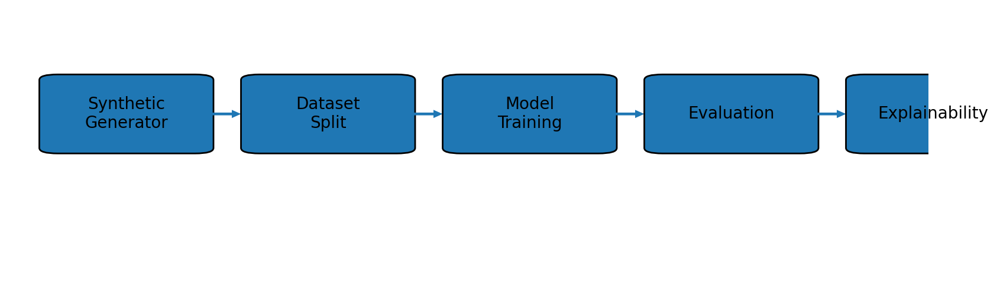
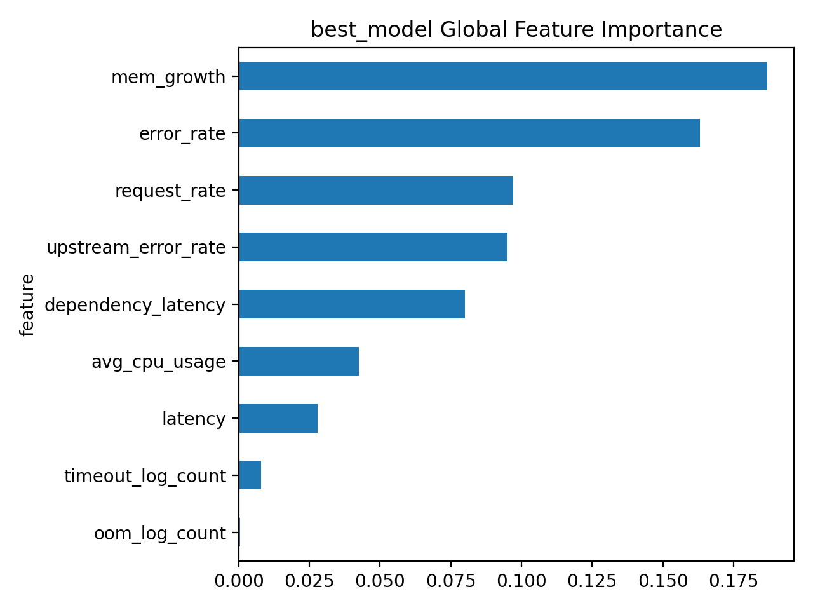

# Incident Intelligence

Incident Intelligence is a machine learning pipeline for **incident root cause classification** using system telemetry signals such as CPU usage, memory growth, request rate, and latency.

The project demonstrates a complete ML workflow:

- Synthetic incident data generation
- Exploratory data analysis (EDA)
- Baseline model training
- Model evaluation
- Model explainability

The goal is to automatically classify the **underlying cause of production incidents** from operational metrics.

---

## ML Pipeline



The repository implements a full ML lifecycle:

1. Synthetic dataset generation
2. Dataset splitting (train / validation / evaluation)
3. Model training with hyperparameter tuning
4. Model evaluation
5. Model explainability

---

## Dataset

The dataset contains simulated telemetry signals from a distributed service.

Features include:

| Feature             | Description              |
| ------------------- | ------------------------ |
| avg_cpu_usage       | CPU utilization          |
| mem_growth          | Memory growth rate       |
| request_rate        | Incoming request rate    |
| latency             | Request latency          |
| dependency_latency  | Upstream service latency |
| upstream_error_rate | Dependency error rate    |
| error_rate          | Application error rate   |
| oom_log_count       | Out-of-memory events     |
| timeout_log_count   | Timeout events           |

Target variable: `root_cause_label`

Classes:

- `bad_deployment`
- `external_dependency_failure`
- `traffic_spike`
- `memory_leak`
- `cpu_saturation`
- `normal`

---

## Quickstart

### 1) Create and activate a virtual environment (macOS / Linux)

```bash
python3 -m venv .venv
source .venv/bin/activate
```

### 2) Install dependencies

```bash
pip install -r requirements.txt
```

---

## Recommended: Run via CLI (A)

The project defines CLI entry points in `pyproject.toml` under `[project.scripts]`.

### 1) Install the package (editable)

From the project root:

```bash
pip install -e .
```

### 2) Run the pipeline

#### Run step-by-step (recommended sequence)

```bash
incident-generate
incident-train
incident-eval
incident-explain
```

#### Run an individual step (one-off)

```bash
incident-generate   # dataset only
incident-train      # train only
incident-eval       # evaluate only
incident-explain    # explainability only
```

#### Run end-to-end (single command)

```bash
incident-pipeline
```

> Note: If the CLI commands are not available, ensure you ran `pip install -e .` successfully.
> The CLI entry points expect modules under `incident_intelligence.cli.*`. If you prefer not to use the CLI, use one of the alternatives below.

---

## Alternative 1: Makefile (B)

A Makefile is provided at the repo root.

### Run end-to-end

```bash
make help
make pipeline
```

### Run step-by-step (recommended sequence)

```bash
make generate
make train
make evaluate
make explain
```

### Run an individual step (one-off)

```bash
make generate
# or
make train
# or
make evaluate
# or
make explain
```

---

## Alternative 2: Run scripts directly (C)

From the project root:

### Run end-to-end

```bash
python scripts/run_pipeline.py
```

### Run step-by-step (recommended sequence)

```bash
python scripts/generate_dataset.py
python scripts/train.py
python scripts/evaluate.py
python scripts/explain.py
```

### Run an individual step (one-off)

````bash
python scripts/generate_dataset.py
# or
python scripts/train.py
# or
python scripts/evaluate.py
# or
python scripts/explain.py
```

---

## Project Structure

```text
incident-intelligence/
├── artifacts/                      # Pipeline outputs, logs, and generated assets
├── config/
│   └── class_config.json           # Class/label configuration
├── data/
│   ├── raw/                        # Raw input data
│   ├── processed/                  # Cleaned/transformed data
│   └── incident_root_cause_data.csv
├── models/                         # Saved trained models
├── notebooks/
│   ├── explainability_outputs/     # Explainability plots/tables
│   ├── 01_data_generation.ipynb
│   ├── 02_eda.ipynb
│   ├── 03_baseline_model.ipynb
│   └── 04_model_explainability.ipynb
├── scripts/
│   ├── generate_dataset.py         # Build dataset artifacts
│   ├── train.py                    # Train model(s)
│   ├── evaluate.py                 # Evaluate model(s)
│   ├── explain.py                  # Explainability artifacts (e.g., SHAP)
│   └── run_pipeline.py             # End-to-end pipeline runner
├── src/incident_intelligence/
│   ├── api/                        # API-related code
│   ├── data/                       # Data processing utilities
│   ├── modeling/                   # Modeling/training utilities
│   ├── __init__.py
│   └── settings.py                 # Central project settings
├── pyproject.toml
├── requirements.txt
└── README.md
````

---

## Notebooks

- **01_data_generation.ipynb**  
  Creates/validates the working dataset from source inputs.

- **02_eda.ipynb**  
  Performs exploratory data analysis (distributions, missing values, trends, correlations).

- **03_baseline_model.ipynb**  
  Trains baseline models and compares initial performance.

- **04_model_explainability.ipynb**  
  Produces explainability outputs (feature importance and model interpretation artifacts).

Recommended order: **01 → 02 → 03 → 04**

---

## Inputs and Outputs

### Inputs

- `data/raw/`
- `data/incident_root_cause_data.csv`
- `config/class_config.json`

### Outputs

- `data/processed/`
- `models/`
- `artifacts/`
- `notebooks/explainability_outputs/`

---

## Generated Outputs

This section describes all artifacts generated during model training and evaluation. These files are created in the `artifacts/` directory when you run the training pipeline.

### Directory Structure

```
artifacts/
├── explain/          # Model explainability artifacts
├── metrics/          # Performance metrics and evaluation results
└── models/           # Trained model files
```

---

### Explainability Artifacts (`artifacts/explain/`)

Visual explanations and feature importance analysis for different models.

#### Sample Output

Below is an example of the global feature importance visualization generated for each model:



_Example: Global feature importance showing the top features ranked by their contribution to model predictions_

The visualizations show:

- **Feature Names**: Key variables in the dataset
- **Importance Scores**: Quantitative measure of each feature's impact
- **Ranked Display**: Features ordered from most to least important

#### Generated Files

| Model               | Global Importance Plot                               | CSV Data                                             |
| ------------------- | ---------------------------------------------------- | ---------------------------------------------------- |
| Best Model          | `best_model_global_importance.png`                   | `best_model_global_importance.csv`                   |
| Gradient Boosting   | `Gradient_Boosting_pipeline_global_importance.png`   | `Gradient_Boosting_pipeline_global_importance.csv`   |
| Logistic Regression | `Logistic_Regression_pipeline_global_importance.png` | `Logistic_Regression_pipeline_global_importance.csv` |
| Random Forest       | `Random_Forest_pipeline_global_importance.png`       | `Random_Forest_pipeline_global_importance.csv`       |
| SVM (RBF)           | `SVM_(RBF)_pipeline_global_importance.png`           | `SVM_(RBF)_pipeline_global_importance.csv`           |

**Additional Files:**

- `explainability_summary.json` - Summary of explainability metrics across all models

---

### Model Performance Metrics (`artifacts/metrics/`)

Performance evaluation files generated during training:

| File                     | Description                                    |
| ------------------------ | ---------------------------------------------- |
| `baseline_metrics.json`  | Baseline model performance metrics             |
| `evaluation_summary.csv` | Summary of all model evaluations               |
| `evaluation.json`        | Detailed evaluation metrics in JSON format     |
| `leaderboard_val.csv`    | Validation leaderboard comparing all models    |
| `train_val_results.json` | Training and validation results for all models |

---

### Trained Models (`artifacts/models/`)

All trained models saved in joblib format for easy deployment:

- `best_model.joblib` - Best performing model from AutoML
- `Gradient_Boosting_pipeline.joblib` - Gradient Boosting classifier pipeline
- `Logistic_Regression_pipeline.joblib` - Logistic Regression classifier pipeline
- `Random_Forest_pipeline.joblib` - Random Forest classifier pipeline
- `SVM_(RBF)_pipeline.joblib` - Support Vector Machine with RBF kernel pipeline

**Note:** Model artifacts are not checked into version control due to file size. Run the training pipeline to generate them locally.

---

## Notes

- Keep large datasets and model binaries out of git unless required.
- Update `config/class_config.json` and `src/incident_intelligence/settings.py` before running custom experiments.
- Prefer CLI / scripts / Makefile for reproducibility; use notebooks for analysis and diagnostics.
