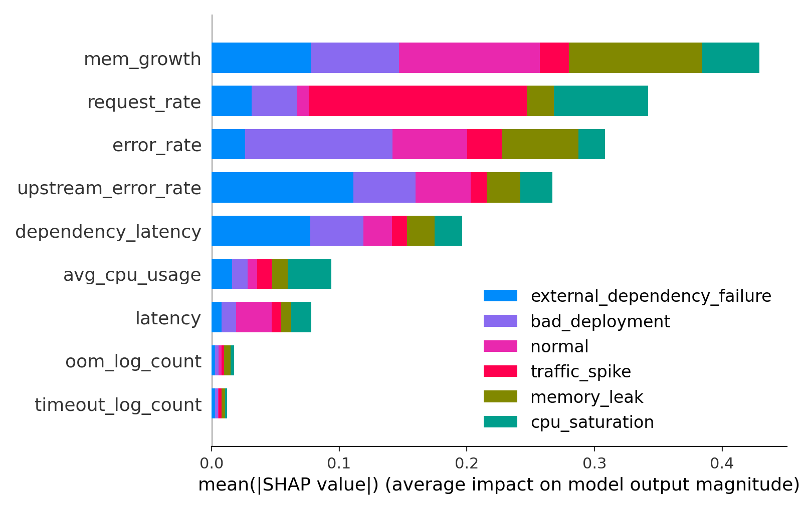
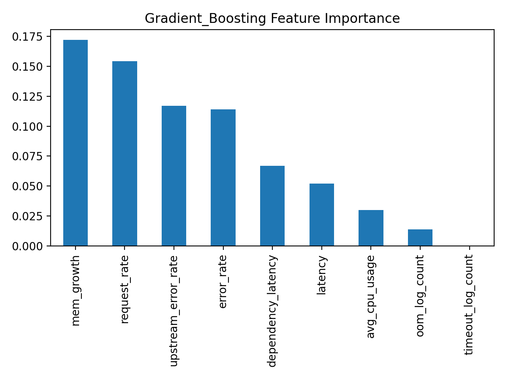
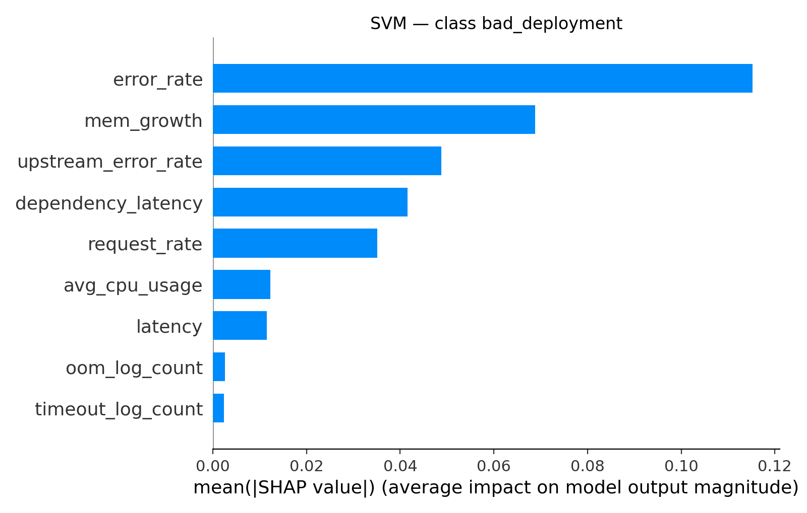

# Visualization Guide

This document explains all visualizations generated by the Incident Intelligence project, how to interpret them, and how to generate them.

---

## Table of Contents

- [Overview](#overview)
- [Feature Importance Visualizations](#feature-importance-visualizations)
  - [Global Feature Importance](#global-feature-importance)
  - [Class-Specific Feature Importance](#class-specific-feature-importance)
- [Model Comparison Visualizations](#model-comparison-visualizations)
- [SHAP Visualizations](#shap-visualizations)
- [Generating Visualizations](#generating-visualizations)
- [Best Practices](#best-practices)

---

## Overview

All visualizations are stored in `notebooks/explainability_outputs/` and are generated by running `04_model_explainability.ipynb`.

### Available Visualization Types

| Type | Purpose | Files |
|------|---------|-------|
| **Global Feature Importance** | Show most important features across all predictions | `*_global_bar.png`, `*_global_shap_bar.png` |
| **Class-Specific Importance** | Show features important for specific incident types | `*_class_*_bar.png` |
| **Model-Specific** | Compare different models | `Gradient_Boosting_importance.png`, etc. |

---

## Feature Importance Visualizations

### Global Feature Importance

Global feature importance shows which features have the most impact on model predictions across **all incident types**.

#### Random Forest Global Importance

**File:** `Random_Forest_global_bar.png`


**What it shows:**
- Features ranked by average importance across all trees
- Higher bars = more important features
- Based on Gini importance (mean decrease in impurity)

**How to interpret:**
```
Feature A ████████████ 0.25    ← Most important (25% of total importance)
Feature B ████████     0.15
Feature C █████        0.10
...
```

**Use cases:**
- Feature selection for model simplification
- Understanding which metrics matter most
- Identifying key monitoring signals

---

#### Random Forest Global SHAP Importance

**File:** `Random_Forest_global_shap_bar.png`



**What it shows:**
- Features ranked by SHAP (SHapley Additive exPlanations) values
- More interpretable than Gini importance
- Shows actual impact on predictions

**How to interpret:**
```
Feature A ████████████ 2.5     ← Average absolute SHAP value
Feature B ████████     1.8
Feature C █████        1.2
```

**SHAP vs Gini Importance:**
- **SHAP**: "How much does this feature change predictions?"
- **Gini**: "How much does this feature reduce uncertainty?"
- SHAP is generally more reliable for interpretation

---

#### Gradient Boosting Feature Importance

**File:** `Gradient_Boosting_importance.png`



**What it shows:**
- Features ranked by their contribution to boosting iterations
- Based on gain (improvement in accuracy)
- Normalized to sum to 1.0

**How to interpret:**
```
Feature A ████████████ 0.32    ← Contributes 32% to model accuracy
Feature B ████████     0.18
Feature C ████        0.09
```

**When to use Gradient Boosting insights:**
- When you need fine-grained feature interactions
- For understanding sequential decision-making
- When dealing with complex non-linear relationships

---

### Class-Specific Feature Importance

Class-specific visualizations show which features are most important for predicting **each individual incident type**.

#### SVM: Bad Deployment

**File:** `SVM_class_bad_deployment_bar.png`



**What it shows:**
- Features that strongly indicate a bad deployment
- SVM coefficient magnitudes
- Positive values push predictions toward "bad deployment"

**Common patterns:**
```
deployment_frequency     ████████  → Recent deployments
error_rate_spike        ████████  → Sudden error increases
rollback_count          ██████    → Number of rollbacks
```

**Action items:**
- Monitor these features closely during deployments
- Set alerts on threshold crossings
- Include in pre-deployment checklists

---

#### SVM: DNS Config Error

**File:** `SVM_class_dns_config_error_bar.png`

**What it shows:**
- Features indicating DNS misconfigurations
- Network-related metrics

**Common patterns:**
```
dns_lookup_failures     ████████  → Failed DNS queries
timeout_rate           ████████  → Connection timeouts
network_latency_spike  ██████    → Sudden latency increases
```

---

#### SVM: External Dependency Failure

**File:** `SVM_class_external_dependency_failure_bar.png`

**What it shows:**
- Features indicating third-party service issues
- API call patterns

**Common patterns:**
```
external_api_errors     ████████  → 3rd party API failures
retry_count            ████████  → Retry attempts
timeout_external       ██████    → External timeouts
```

---

#### SVM: Memory Leak

**File:** `SVM_class_memory_leak_bar.png`

**What it shows:**
- Features indicating memory management issues
- Memory usage patterns

**Common patterns:**
```
memory_growth_rate      ████████  → Memory increasing over time
gc_frequency           ████████  → Garbage collection events
heap_size_trend        ██████    → Heap usage trend
```

---

#### SVM: Traffic Spike

**File:** `SVM_class_traffic_spike_bar.png`


**What it shows:**
- Features indicating unusual traffic patterns
- Load and capacity metrics

**Common patterns:**
```
requests_per_second     ████████  → Request rate
connection_count       ████████  → Active connections
bandwidth_usage        ██████    → Network bandwidth
```

---

#### SVM: Normal Operation

**File:** `SVM_class_normal_bar.png`

**What it shows:**
- Features characteristic of normal system behavior
- Baseline metrics

**Common patterns:**
```
stable_latency         ████████  → Consistent response times
low_error_rate        ████████  → Minimal errors
steady_throughput     ██████    → Consistent load
```

---

#### Random Forest: Class-Specific Importance

**Files:** 
- `Random_Forest_class_normal_bar.png`
- `Random_Forest_class_traffic_spike_bar.png`

**What they show:**
- Random Forest's perspective on class-specific features
- May differ from SVM due to different model architectures

**When to compare:**
- Use when models disagree on important features
- Helps identify robust vs model-specific patterns
- Useful for ensemble insights

---

## SHAP Visualizations

### SHAP Summary Plot

SHAP (SHapley Additive exPlanations) provides model-agnostic explanations.

**File:** `*_global_shap_bar.png`

**Components:**
```
Feature A ████████████     ← Feature importance
Feature B ████████         
  🔴────●────🔵           ← Impact direction
  negative  neutral  positive
```

**Color coding:**
- 🔴 **Red/Pink**: Feature pushes prediction toward positive class
- 🔵 **Blue**: Feature pushes prediction toward negative class
- Intensity: Strength of impact

**Reading SHAP plots:**
1. **Y-axis**: Features (sorted by importance)
2. **X-axis**: SHAP value (impact on prediction)
3. **Color**: Feature value (high/low)
4. **Width**: Distribution of impacts

---

## Model Comparison Visualizations

### Comparing Feature Importance Across Models

To understand feature importance consensus:

1. **Review all models:**
   - Gradient Boosting
   - Random Forest
   - SVM

2. **Look for agreement:**
   ```
   Gradient Boosting: Feature A (1st), Feature B (2nd)
   Random Forest:     Feature A (1st), Feature B (3rd)
   SVM:               Feature A (2nd), Feature B (1st)
   
   Consensus: Features A and B are critical
   ```

3. **Investigate disagreements:**
   - May indicate model-specific biases
   - Could reveal complex interactions
   - Worth deeper analysis

---

## Generating Visualizations

### Automated Generation

Run the explainability notebook:

```bash
jupyter notebook notebooks/04_model_explainability.ipynb
```

Then execute all cells (Cell → Run All)

### Programmatic Generation

```python
import pickle
import shap
import matplotlib.pyplot as plt
import numpy as np

# Load trained model
with open('models/Random_Forest.pkl', 'rb') as f:
    model = pickle.load(f)

# Load test data
X_test = pd.read_csv('data/processed/incident_root_cause_eval.csv')
y_test = X_test['root_cause']
X_test = X_test.drop('root_cause', axis=1)

# Generate SHAP values
explainer = shap.TreeExplainer(model)
shap_values = explainer.shap_values(X_test)

# Create global importance plot
shap.summary_plot(shap_values, X_test, plot_type="bar", show=False)
plt.tight_layout()
plt.savefig('notebooks/explainability_outputs/custom_shap_bar.png', 
            bbox_inches='tight', dpi=300)
plt.close()

# Create class-specific plot for class 0
shap.summary_plot(shap_values[0], X_test, show=False)
plt.title('Class 0: Bad Deployment - Feature Impact')
plt.savefig('notebooks/explainability_outputs/custom_class_0.png',
            bbox_inches='tight', dpi=300)
plt.close()
```

### Custom Visualization Examples

**Feature importance bar chart:**
```python
import pandas as pd

# Get feature importances
importances = model.feature_importances_
features = X_test.columns

# Create dataframe and sort
df = pd.DataFrame({
    'feature': features,
    'importance': importances
}).sort_values('importance', ascending=False)

# Plot
plt.figure(figsize=(10, 8))
plt.barh(df['feature'][:20], df['importance'][:20])
plt.xlabel('Importance')
plt.title('Top 20 Features - Random Forest')
plt.tight_layout()
plt.savefig('custom_importance.png', dpi=300)
```

**Class-specific importance:**
```python
from sklearn.inspection import permutation_importance

# Calculate permutation importance for specific class
result = permutation_importance(model, X_test, y_test, 
                                n_repeats=10, random_state=42)

# Plot
sorted_idx = result.importances_mean.argsort()
plt.figure(figsize=(10, 8))
plt.boxplot(result.importances[sorted_idx][-20:].T,
            labels=X_test.columns[sorted_idx][-20:],
            vert=False)
plt.xlabel('Permutation Importance')
plt.tight_layout()
plt.savefig('permutation_importance.png', dpi=300)
```

---

## Best Practices

### Interpretation Guidelines

1. **Don't rely on single visualization**
   - Compare multiple models
   - Check both global and class-specific
   - Validate with domain knowledge

2. **Watch for feature correlation**
   - Correlated features split importance
   - May need to group related features
   - Consider PCA or feature engineering

3. **Context matters**
   - High importance ≠ causation
   - Consider data collection biases
   - Validate with incident post-mortems

### Visualization Standards

**For presentations:**
- Use SHAP plots (more interpretable)
- Focus on top 10-15 features
- Add annotations for key insights

**For technical analysis:**
- Include all feature importance types
- Compare across models
- Document disagreements

**For monitoring dashboards:**
- Show only top 5-10 features
- Update periodically (weekly/monthly)
- Track changes over time

### Common Pitfalls

❌ **Don't:**
- Interpret importance as causation
- Ignore class imbalance effects
- Use only one model's perspective
- Forget to validate with domain experts

✅ **Do:**
- Cross-validate insights across models
- Consider feature interactions
- Document assumptions
- Regularly update with new data

---

## Visualization Checklist

Before deploying insights:

- [ ] Generated visualizations for all trained models
- [ ] Compared feature importance across models
- [ ] Reviewed class-specific patterns
- [ ] Validated top features with domain knowledge
- [ ] Documented any surprising findings
- [ ] Saved high-resolution versions (300 DPI)
- [ ] Added to version control (if appropriate)

---

## Resources

**SHAP Documentation:**
- [SHAP GitHub](https://github.com/slundberg/shap)
- [SHAP Paper](https://arxiv.org/abs/1705.07874)

**Feature Importance:**
- [Scikit-learn Feature Importance](https://scikit-learn.org/stable/auto_examples/ensemble/plot_forest_importances.html)
- [Permutation Importance Guide](https://scikit-learn.org/stable/modules/permutation_importance.html)

**Best Practices:**
- [Interpretable ML Book](https://christophm.github.io/interpretable-ml-book/)
- [Google's ML Explainability Guide](https://pair.withgoogle.com/explorables/)

---

*For questions or issues with visualizations, refer to `04_model_explainability.ipynb` or open an issue.*